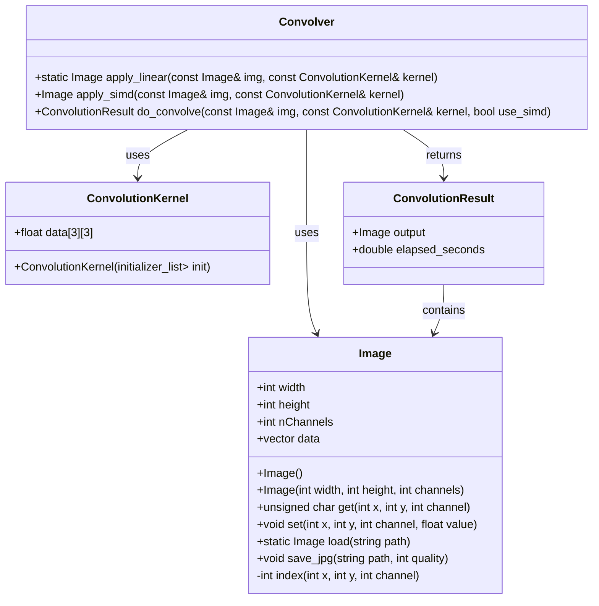

# How to Get the Dataset

1. Visit the Kaggle dataset page:  
   https://www.kaggle.com/datasets/anonymousds2025/pet-cats-and-stray-cats-2025

2. Download the `.zip` file.

3. Extract its contents into the **root directory** of the project.

After extraction, your project structure should look like this:

```
CAR-practica2
├── build
├── include
├── LostCat-PS
└── LostCat-PSC
```

# How to compile and run code

First get the dataset from Kaggle (see instructions above).

Afterward, simply open a terminal window and execute the following (**make sure you're at the
project's root!**):

`./run_full_suite.sh`

# Class diagram



## Flags (unnecessary; simply follow instructions above)

You can pass the following flags when running `compile_and_run.sh`:

- `--simd` — use SIMD‑accelerated convolution
- `--nosimd` — use the scalar (non‑SIMD) convolution
